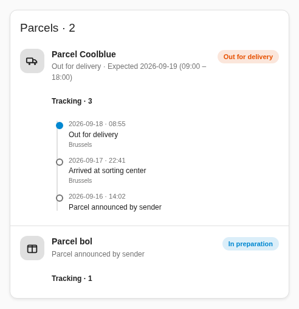
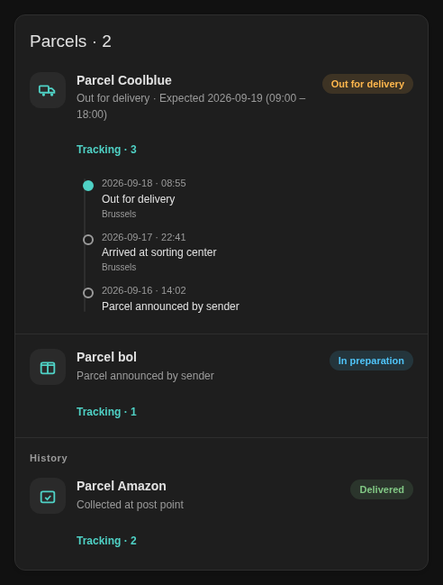

# My bpost for Home Assistant

[](https://github.com/hacs/integration)
[](https://github.com/Sr-0w/ha-bpost/releases)
[](https://github.com/Sr-0w/ha-bpost/actions/workflows/validate.yml)

Unofficial Home Assistant integration for **My bpost** (Belgium). It logs in
with your My bpost account and exposes your parcels as entities. You can also
track a parcel without an account using its barcode and delivery postal code.

Requires **Home Assistant 2026.2.3 or newer**. Version **0.8.0b1** is a beta:
in HACS, enable beta versions for this repository before selecting it. The minimum
was raised after a runtime test found that HA 2025.1 cannot register the new
admin actions with response data.

> **Disclaimer:** community project, not affiliated with bpost. It talks to
> the same JSON API as the official Android app, so a bpost app/backend
> update can break it until a new release adapts.

## Features

- Automatic discovery of every parcel linked to your account
- Manual public tracking without an account, with independent parcel entries
- Bulk import (up to 20 parcels), named groups and HA management actions
- Cross-source duplicate filtering, a Today view and readable tracking health
- Stable parcel states for automations, with bpost's original code in `raw_status`
- Separate incoming/outgoing counters and account-scoped entity identities
- One sensor per parcel (status, sender, ETA, last event, pickup point…)
  plus a `sensor.my_bpost_packages` counter
- `device_tracker` entities when bpost provides coordinates
- Full per-parcel history with timestamps (attributes)
- Events for automations: `my_bpost_new_package`, `my_bpost_status_changed`,
  `my_bpost_out_for_delivery`, `my_bpost_delivered`
- Nine device triggers selectable in Home Assistant's automation editor
- Delivery calendar per account, with estimated windows or all-day estimates
- Automatic removal of inactive parcel entities after a configurable retention period
- Mail Ahead availability, letter count, announcements and optional envelope images
- UI setup (FR / NL / EN / DE), re-authentication flow, redacted diagnostics
- Generic Lovelace card with tracking timelines (theme-aware, EN/FR/NL/DE)
- Visual card editor, sorting and a discreet display mode
- Grouped parcel notifications, daily digests, pickup reminders and Mail Ahead alerts
- Live delivery ETA and remaining stops when bpost provides them, with a separate
  courier tracker and an explicit unavailable state for missing or expired data

## Installation (HACS)

1. In HACS, open the ⋮ menu → **Custom repositories**, add
   `https://github.com/Sr-0w/ha-bpost` with category **Integration**.
2. Install **My bpost**, then restart Home Assistant.
3. Go to Settings → Devices & Services → Add Integration → **My bpost**,
   choose **My bpost account**, and enter your email + password.

[](https://my.home-assistant.io/redirect/hacs_repository/?owner=Sr-0w&repository=ha-bpost&category=integration)

### Manual installation

Download `bpost.zip` from the
[latest release](https://github.com/Sr-0w/ha-bpost/releases). Starting with 0.6.0,
extract its contents **into `config/custom_components/my_bpost/`**, then restart.
The archive root contains `manifest.json`, `pybpost/` and `frontend/`; do not
extract it directly into `config/`. Earlier archives included the
`custom_components/my_bpost/` parent directories.

Use the release asset for installation: the source checkout alone does not include
the bundled Python client. Notification blueprints are installed separately as
described below.

### Upgrading

Keep a Home Assistant backup before upgrading. Install the new release and restart
Home Assistant. Accounts created with 0.2.0 require a one-time sign-in from the
integration's reauthentication prompt; their saved password is removed during
migration. Existing account/entity IDs, custom names and options are preserved.
Accounts already using session tokens can reload without entering a password.

To roll back a migrated account, restore the matching backup and integration
version together. Installing old files alone does not reverse the config-entry
migration. See [release notes](CHANGELOG.md) for this release's scope.

### Track a parcel without an account (0.7.0)

Add **My bpost** in Devices & Services and choose **Track a parcel without an
account**. Enter the barcode, delivery postal code, optional display name and
language. The public API validates the pair before saving it. A newly created
shipping label may not be searchable yet; retry once bpost has announced it.

Each manual parcel is a separate integration entry. Its sensor, delivery calendar
and supplied pickup location appear alongside account parcels in the card. In
the entry's options you can edit the postal code, display name, direction and
retention. Incoming/outgoing direction is unspecified until you choose it:
knowing a barcode does not establish whether you are the sender or recipient.
Choose **Delete** on that integration entry to stop tracking and remove its
entities; this does not change the parcel in bpost or another account entry.

Public entries poll every 15 minutes while active and hourly after delivery or
return, respecting HTTP 429 pauses. Outages or a temporarily missing lookup make
entities unavailable while preserving the entry for retry. Delivered/returned
parcel entities use the same retention policy (7 days by default). The entry
remains until you delete it. A real process restart preserves identities and
announcement history. Tracking a parcel that is also in an account creates two
independent sources. In 0.8.0 the card, daily summary and grouped notification
stream deduplicate matching barcodes. Entity IDs and raw device triggers remain
independent. See [daily workflows](docs/daily-workflows.md) for source selection.

No account tokens, client key or cookies are sent to public tracking. The barcode
and postal code are stored locally in HA and sent to `track.bpost.cloud`; protect
HA configuration and backups. Diagnostics redact these inputs and display names.
Mail Ahead and live courier GPS/stops are account-only features. Public entries
provide eight parcel device triggers and work with the parcel notification
blueprint; they do not provide letter triggers or image entities.

## Entities

| Entity | Description |
|---|---|
| `sensor.my_bpost_packages` | Number of active parcels (+ totals, codes, last fetch) |
| `sensor.my_bpost_<sender>` | One per parcel; state = status, attributes = sender, cities, ETA, last event, pickup point, history |
| `device_tracker.my_bpost_<sender>` | Present when coordinates are available |
| `calendar.my_bpost_deliveries` | Upcoming delivery estimates for this account (read-only) |
| Mail Ahead status sensor | Available, not subscribed, not eligible, unknown or disabled |
| Letters (30 days) sensor | Letters in the available rolling window; unavailable when it cannot be read |
| Letter image entities | Optional scans fetched when viewed, through Home Assistant's image proxy |

Entity IDs are examples; Home Assistant may translate names or add a suffix.

Additional incoming/outgoing counters count active parcels with a known account
role. A parcel missing role data remains in the global count. Courier trackers
are separate from pickup locations and appear only after valid live coordinates
have been received.

Account polling adapts to activity: 30 minutes without active parcels, 10 minutes
in transit, and 5 minutes when a parcel is out for delivery. Automations can trigger on the
`my_bpost_*` events above (payloads carry the parcel code and statuses).

## Lovelace card

The integration ships a generic parcels card (auto-registered, no manual
resource needed). It follows the default Home Assistant theme as well as
any theme applied to the card, and is available in the card picker as
**Bpost Parcels**:

```yaml
type: custom:my-bpost-parcels-card
title: Parcels
show_history: true # also list delivered parcels (default: false)
```

| Default theme | Themed card |
|---|---|
|  |  |

*(Screenshots rendered with fictional demo data.)*

### Visual editor

Edit the **Bpost Parcels** card in a dashboard to choose a title, account,
incoming/outgoing filter, Today view, group, duplicate filtering, sort order,
inactive history, live section and discreet mode without writing YAML. Account labels use integration entry titles when
available. A temporarily unavailable selected account stays selected.

| Option | Default | Behavior |
| --- | --- | --- |
| `account_id` | All accounts | Limits the card to the selected account |
| `view` | `all` | `today` groups deliveries expected today, pickups and problems |
| `group` | All groups | Exact group name configured on the entry |
| `deduplicate` | `true` | One observation per exact tracking number, after filters |
| `direction` | `all` | `all`, `incoming` or `outgoing` |
| `sort_by` | `priority` | `priority`, `delivery_date`, `updated` or `name` |
| `show_history` | `false` | Includes inactive parcels still retained by the integration |
| `show_live` | `true` | Displays live information; hiding it does not stop API polling |
| `privacy_mode` | `false` | Shows numbered parcels and canonical statuses only |

Priority sorting puts delivery problems, ready-to-collect parcels and deliveries
in progress first. Invalid/missing dates sort last. Active parcels and history
remain separate. Discreet mode omits names, addresses, tracking IDs, events, ETA
and maps from the card's rendered HTML. It does not change HA entity data,
permissions, other cards or a custom title you choose yourself.

### Notification blueprints

Three ready-to-configure blueprints are included under
[`blueprints/automation/my_bpost`](blueprints/automation/my_bpost):

- [Parcel notifications](blueprints/automation/my_bpost/parcel_notifications.yaml):
  choose delivery events, incoming/outgoing parcels, language and optional tracking
  details. Default notifications cover out-for-delivery, ready-to-collect,
  delivered and delivery problems.
- [New-letter notifications](blueprints/automation/my_bpost/mail_notifications.yaml):
  notify when a new Mail Ahead letter is announced, without attaching scans or
  private image links.
- [Daily digest / pickup reminder](blueprints/automation/my_bpost/daily_notifications.yaml):
  one summary at the chosen local time, optionally limited to a group or to days
  with parcels ready for collection. Counts only; no personal parcel details.

The current parcel/daily blueprints require My bpost 0.8.0b1+; letters require
0.6.0+. All require Home Assistant 2026.2.3+ and a phone/tablet registered
with the Home Assistant Companion app. Download the YAML assets from the same
release as the integration (the beta assets work before the PR is merged). Copy them to
`config/blueprints/automation/my_bpost/`, reload blueprints from the HA interface,
then create an automation. Select the receiving phone. For parcel alerts, choose
a My bpost device, then enable **all sources** in one automation to follow the
deduplicated stream across accounts and manual parcels. Without that switch,
the automation follows only events whose selected source belongs to that device.
After these files are published on GitHub, their GitHub file URLs can also be
used with HA's **Import blueprint** dialog. Local workspace changes alone do not
make those import URLs available.

Notifications support FR/EN/NL/DE and open the dashboard path you choose. Tracking
details are off by default; sender names and addresses are never included.
An opaque per-parcel tag lets updates replace that parcel's notification across
sources; letters retain account-specific tags. Parcel updates within 30 seconds
are grouped into one final observation. ETA alerts require a material change
(default 30 minutes, configurable in entry options); small shifts accumulate.
The baseline survives restart. Phone push behavior still depends on Companion
and the OS. Update existing blueprint copies and reload automations to use the
new stream; custom raw-event automations keep their existing behavior.

Quiet hours are optional and use HA's configured timezone. They can cross midnight;
the start is inclusive and the end exclusive. Equal start/end times disable the
quiet period. Events during quiet hours are **skipped**, not queued for the morning.
No automation or phone notification is enabled merely by installing the integration.

See [daily workflows](docs/daily-workflows.md) for bulk import, management actions,
health states, summary fields and notification delivery limits.

## Migrating from 0.1.x (domain rename)

Version 0.2.0 renames the integration domain from `bpost` to `my_bpost`
so it coexists with other bpost integrations. To migrate: remove the old
**bpost** config entry, update to 0.2.0, restart, then add **My bpost**
again with your email + password. Entity IDs (`sensor.my_bpost_*`) are
usually preserved, but a few parcel IDs may be regenerated from bpost's
current name data — update anything referencing exact parcel entity IDs.
Automations must switch to the `my_bpost_*` events and dashboards to
`custom:my-bpost-parcels-card`.

## Changes in 0.5.0: Mail Ahead

Mail Ahead checks the service's eligibility/subscription flags and fetches announced
letters for subscribed accounts. Enable the service in the official bpost app if
bpost makes it available to your account; this integration never subscribes you or
changes your account. **Mail Ahead status** distinguishes `available`,
`not_subscribed`, `not_eligible`, `unknown` and `disabled`.

**Letters (30 days)** counts distinct letters in the rolling 30-day window ending
today in Belgium. It is not a count of unread letters or letters arriving today.
An empty, successfully retrieved mailbox reads zero; unavailable access or an API
failure makes the sensor unavailable. Mail polling runs every 30 minutes when
available, every 12 hours otherwise. It respects rate limits and operates
independently of parcel updates. Disable it through **Configure → Enable Mail Ahead**.

### Letter images

Images are **off by default**. Enable **Configure → Enable letter images** to
create one native `image` entity per letter with a scan. Use these entities in
Home Assistant's picture-entity cards or their more-info dialogs. For example,
replace this entity with one offered by your account:

```yaml
type: picture-entity
entity: image.my_bpost_letter_2026_10_06
show_state: false
```

Images download only when viewed. Home Assistant serves them through its native
image proxy, which requires a logged-in session or a rotating HA image token.
Treat copied HA image links as private. Envelope scans can contain names and
addresses. The integration does not expose bpost's signed image URLs, senders,
raw letter identifiers or image references in entity attributes, events or diagnostics.
It stores neither scans nor signed links on disk; cached image bytes are reused
for at most 15 minutes and invalidated when references change or the mailbox fails.
Browser caches and snapshots explicitly requested through HA are separate.

Downloads use a separate session without bpost account headers/cookies, verified
HTTPS and no redirects. Supported hosts are bpost.be, bpost.cloud and their
subdomains, plus Azure Blob Storage (`*.blob.core.windows.net`). Only PNG, JPEG
and WebP scans up to 5 MiB are accepted. An unsupported image does not break
parcel tracking or the mail count. Image entities disappear after a successful
refresh removes their letter/scan, or when images are disabled.

### New-letter automation

The account device offers **New letter announced**, backed by
`my_bpost_letter_announced`. Its payload contains `entry_id`, an opaque `mail_id`,
`date` and optional `planned_delivery`. The first successful mailbox import is
silent. A persisted baseline of hashed IDs prevents repeated announcements after
restarts and temporary disappearance. Only hashes and last-seen timestamps are
stored; absent IDs expire from that baseline after 60 days of successful polling.

Live validation on 2026-10-06 confirmed the summary and letter-list endpoints.
The test account was reported **not eligible and not subscribed**, with an empty
image map. Populated letters and scan downloads are validated with synthetic
fixtures and Home Assistant's real image proxy; an eligible account is still
needed to confirm populated backend payloads and image hosts.

## Changes in 0.4.0

### Parcel retention

Configure **Days to keep inactive parcels** under Settings → Devices & Services →
My bpost → Configure. The default is 7 days; the supported range is 1–365 days.
The clock starts when the integration first observes that a parcel is inactive
or absent from a successful account refresh. Existing history receives the same
grace period when upgrading. Active parcels are always kept.

After that period, the next successful account refresh removes the parcel sensor
and its pickup/courier trackers from Home Assistant's entity registry and the card.
The inactivity clock survives restarts. Historical parcels still returned by bpost
remain hidden; a parcel that becomes active again can be discovered again.
Temporary API failures do not purge entities. Account counters, calendars and
other accounts are preserved. This does not delete parcels from bpost or erase
Recorder history; Recorder keeps its own retention policy.

### Device triggers

In an automation, choose **Device → My bpost** and select a trigger:

| Trigger | Event |
| --- | --- |
| New parcel | `my_bpost_new_package` |
| Status changed | `my_bpost_status_changed` |
| Out for delivery | `my_bpost_out_for_delivery` |
| Delivered | `my_bpost_delivered` |
| Ready to collect | `my_bpost_at_pickup_point` |
| Returned to sender | `my_bpost_returned` |
| Delivery problem | `my_bpost_problem` |
| Estimated delivery window changed | `my_bpost_eta_changed` |
| New letter announced (0.5.0) | `my_bpost_letter_announced` |

Device triggers filter events to the selected account. Parcel information is in
`trigger.event.data`, including `item_code`, `status`, `entry_id` and `direction`.
The initial account import is silent; repeated identical statuses are suppressed.
ETA changes compare the account API's date/window, independently of live courier
polling. The first ETA and a missing date do not fire this trigger. A changed
existing estimate includes `old_eta` and `new_eta`, each `[day, start, end]`.
That baseline persists across restarts and temporary gaps.

### Delivery calendar

Each account exposes a read-only **Deliveries** calendar usable in calendar cards,
the calendar view and calendar automations. Active parcels with a dated estimate
appear once. An updated estimate moves the same event; completed deliveries leave
the calendar. No extra API polling is needed.

Complete valid windows use Belgian local time (`Europe/Brussels`, including
daylight saving). A date with missing, invalid or reversed times becomes an all-day
event. Missing or unparseable dates produce no event; supported date formats are
`YYYY-MM-DD`, `DD/MM/YYYY` and `DD-MM-YYYY`. These are estimates, not appointments
confirmed by bpost. Calendar entries contain parcel labels and tracking numbers,
so only share this calendar with people who should see those details.

## Changes in 0.3.0

Parcel states are now `registered`, `in_transit`, `out_for_delivery`,
`at_pickup_point`, `delivered`, `returning`, `returned`, `problem`, or `unknown`.
Update automations comparing old API status strings; the original value remains
available in `raw_status`. An inactive parcel is not assumed delivered. Returns
to the sender use `returned`, not `delivered`.

Entity registry identities are migrated per account while preserving existing
entity IDs and dashboard references. The first inbox fetch establishes a silent
baseline. Later real changes generate events; the last known states are retained
for 30 days to avoid duplicate new-parcel events after a restart or temporary
disappearance. Event payloads include `entry_id`, canonical `status`, `raw_status`,
and `direction`; status-change events include `old_status` and `new_status`.
These replace the former raw `previous` tuple in status-change events.

### Live delivery

Live tracking is enabled by default and can be disabled through the integration's
Configure dialog. It requires an active, recognized out-for-delivery parcel and
a recipient postcode supplied by the account API. No postcode is guessed from
the pickup point or sender.

Live requests are separate from account discovery, limited to two requests per
account in a rolling minute and at least 60 seconds between requests for one
parcel. Longer server intervals and HTTP 429 `Retry-After` are respected; missing
data and errors back off. Live observations expire after twice the requested
interval, bounded between two and ten minutes. An expired courier tracker becomes
unavailable and loses its coordinates; pickup coordinates are never substituted.

The card displays the supplied ETA, remaining stops (including a real zero), and
observation time. Its map button opens Home Assistant's native courier entity
details. Optional `account_id` and `direction: incoming | outgoing | all` settings
filter the card. The card also discovers renamed entities through their integration
attributes. API text is escaped before rendering.

Live fields are conditional on bpost's backend. The account used for validation
had no eligible live delivery; courier behavior has been tested with synthetic
payloads in a real HA runtime. `live_progress_raw` is exposed without assuming
percentage units, and no progress bar is shown until those units are verified.

## About the client key

The bpost backend requires a client key (`x-api-key`) on every call. This
is bpost's **generic application key** — the same value ships, obfuscated,
in every install of the official app, so it is embedded directly in this
integration. You only ever enter your email and password.

If bpost rotates the key or ships an incompatible app update, the
integration will report an authentication/connection error until a new
release is published — please open an
[issue](https://github.com/Sr-0w/ha-bpost/issues) with your diagnostics
(personal data is redacted automatically).

## Development

### Session storage

New configurations store access and refresh tokens, never the account password.
The password is used only for the initial login or explicit reauthentication.
Rotated tokens are saved back to the Home Assistant config entry without
reloading the integration. Tokens are credentials: protect Home Assistant's
configuration directory and backups.

Existing version-1 config entries migrate locally to version 2, removing their
stored password while keeping their entry and entity IDs. They require a
one-time sign-in through Home Assistant's reauthentication flow. Temporary API
outages do not require another sign-in; a rejected refresh token does.

### Tests

Use Python 3.13. From the repository root:

```sh
python3 -m venv .venv
.venv/bin/python -m pip install -e ./pybpost --config-settings editable_mode=compat
.venv/bin/python -m unittest discover -s tests -v
.venv/bin/python -m pip install -r requirements-dev.txt
.venv/bin/python -m unittest discover -s tests/ha -v
node --test tests/frontend/*.test.cjs
```

The client tests run against a local HTTP server with synthetic credentials.
The full Home Assistant runtime tests build and extract the actual release ZIP
in a temporary configuration directory;
they do not vendor files into the source checkout or contact bpost. They cover
config flows, migration, token rotation, reauthentication, error handling, and
diagnostic redaction, status transitions, account-scoped identities, polling limits,
retention across restart and reactivation, account-filtered device triggers,
calendar windows/timezones, and a real HA runtime with synthetic courier data.
The runtime check exercises calendar services, device-trigger discovery, entity
removal and re-creation. The Node tests check card
rendering and interactions with a minimal DOM harness, not a real browser.
Live account validation is a separate check.

### Release archive and distribution checks

```sh
python3 scripts/build_release.py --tag v0.8.0b1 --output bpost.zip
BPOST_RELEASE_ZIP="$PWD/bpost.zip" .venv/bin/python -m unittest discover -s tests/ha -v
```

The builder checks all three version declarations and the release tag, bundles
the client and existing brand assets, and excludes caches and development files.
Identical inputs produce identical archives. HACS extracts this ZIP directly into
the integration directory (`zip_release: true`). CI tests its built artifact, and
the release workflow repeats the HA tests before uploading it.

[Distribution validation](docs/distribution-validation.md) records the official
HACS/hassfest versions, results, reproduction commands and remaining limits.

Mail tests cover capability states, strict response parsing, private image transport,
bounded downloads, request headers, persistent announcement deduplication, failure
isolation and image cache invalidation. The full HA mail runtime test checks native
image-token access, refusal without authorization, reloads, removal, reappearance
and opt-out. No real letters or credentials are used in those tests.

An optional real Chromium check exercises the card with synthetic data and
minimal Home Assistant host elements (Playwright and system Chromium required):

```sh
CHROMIUM_EXECUTABLE=/usr/bin/chromium python3 tests/frontend/browser_smoke.py
```

Set `BPOST_ARTIFACT_DIR` to choose where its demo screenshot is saved. This check
does not authenticate or include real parcel data.

```text
custom_components/my_bpost/   # integration (config flow, coordinator, platforms)
pybpost/                   # standalone async client (source of truth)
scripts/extract_key.py     # re-derive the x-api-key from the official app lib
tests/                     # packaging and client HTTP tests
tests/ha/                  # Home Assistant session and migration tests
```

`pybpost/` is vendored into the release asset by
`.github/workflows/release.yml`, which also checks that `manifest.json`
matches the release tag. To cut a release: bump `version` in
`custom_components/my_bpost/manifest.json` (and `pybpost/pyproject.toml`),
push, then publish a GitHub release tagged `vX.Y.Z` — CI attaches
`bpost.zip` automatically. If bpost rotated the key, re-extract it first
with `scripts/extract_key.py` against the current app release.

## License

[MIT](LICENSE)
